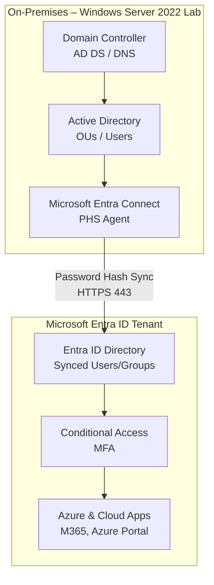

# Hybrid Identity Lab – On-Prem AD DS ↔ Microsoft Entra ID

Erweiterung meines bestehenden Homelabs um eine hybride Identitätsanbindung zwischen
lokalem Active Directory und Microsoft Entra ID. Ziel: praktische Umsetzung der
AZ-104-Domäne "Identities & Governance" auf realer Infrastruktur, nicht nur in der
Theorie.

> Teil der [it-infrastructure-lab](https://github.com/DFelux/it-infrastructure-lab) Reihe.

## Architektur

Infrastruktur läuft auf Azure (Resource Group `hybrid-identity-lab`, Region Germany
West Central): VM `vm-germany-ad-01`, zugehöriges VNet, NSG und Public IP.

## Ziele

- [x] Microsoft Entra Connect Sync aufsetzen (PHS – Entscheidung dokumentiert, s.u.)
- [x] Entra Hybrid Join für Windows-11-Client
- [ ] Conditional-Access-Policy (MFA-Enforcement)
- [ ] RBAC-Vergleich lokale AD-Gruppen vs. Entra-ID-Rollen
- [ ] Tagging- und Lock-Konzept auf Ressourcengruppen-Ebene
- [x] Troubleshooting-Runbook für Sync-Fehler (vier reale Fälle unten dokumentiert)

## Warum dieses Projekt

Bestehende Homelab-Komponenten (AD DS, Zammad-Ticketsystem) decken On-Premises-Themen
ab. Dieses Projekt schließt gezielt die Lücke zu Cloud-Identity-Management, das im
AZ-104-Examen einen der größten Gewichtsanteile hat.

## Setup

### Voraussetzungen

- Azure-Subscription (Free/Dev Tier ausreichend)
- Bestehendes AD DS Lab (siehe [it-infrastructure-lab](https://github.com/DFelux/it-infrastructure-lab))
- Windows Server mit .NET Framework 4.7.2+ für Entra Connect

### Installation – Schritt für Schritt

1. Microsoft Entra Connect auf der VM herunterladen und Setup starten
2. **Custom Installation** wählen (nicht Express – volle Sync-Regel-Kontrolle)
3. Im Schritt "Herstellen einer Verbindung mit Microsoft Entra ID" mit dem globalen
   Administrator-Konto anmelden

   

4. Lokales AD DS verbinden (Enterprise Admin-Anmeldedaten), betroffene OU auswählen
5. Anmeldekonfiguration (UPN-Suffix-Abgleich) prüfen und bestätigen

   

6. Benutzeridentifikation: Standardwerte (eindeutige Darstellung, Quellanker durch
   Azure verwalten) übernehmen

   

7. Optionale Features: **Kennwort-Hashsynchronisierung** aktiviert lassen, alle
   anderen Optionen (Password Writeback, Group Writeback etc.) für diese Phase
   deaktiviert lassen

   

8. Konfiguration abschließen, Sync starten

## Entscheidung: PHS vs. PTA

| Kriterium                            | Password Hash Sync          | Pass-through Authentication              |
| ------------------------------------- | ---------------------------- | ------------------------------------------ |
| Ausfallsicherheit bei Azure-Störung  | Höher (Hash liegt in Cloud)  | Abhängig von Agent/On-Prem                |
| Infrastruktur-Overhead                | Gering                        | PTA-Agent-Server nötig                    |
| Bevorzugt für                         | Kleine/mittlere Umgebungen   | Umgebungen mit strikten On-Prem-Policies  |

**Entscheidung: Password Hash Synchronization (PHS).** Für dieses Homelab gibt es
keine regulatorische Anforderung, Passwort-Validierung strikt On-Prem zu halten.
PHS erfordert keinen zusätzlichen Agent-Server, ist der in der Praxis am
häufigsten eingesetzte Weg bei KMU und bietet zusätzlich Schutz durch
Microsofts "Leaked Credentials"-Erkennung. Federation (AD FS) wurde nicht in
Betracht gezogen, da der Infrastruktur- und Wartungsaufwand für dieses Lab-Szenario
nicht gerechtfertigt ist.

## Troubleshooting-Log

### 1. Verwechslung: Microsoft Entra Cloud Sync vs. klassisches Entra Connect

Beim ersten Versuch landete ich über einen falschen Menüpunkt im Entra Admin Center
auf der Konfigurationsseite für **Cloud Sync** statt der klassischen
**Entra-Connect-Sync**-Installation auf der VM. Cloud Sync nutzt einen separaten,
leichtgewichtigen Provisioning-Agent und unterstützt ausschließlich PHS – es gibt
dort keine PTA-/Federation-Auswahl.

**Lösung:** Konfiguration abgebrochen, stattdessen den lokalen
Installationsassistenten auf der VM (Microsoft Entra Connect-Synchronisierung)
fortgesetzt.

### 2. Anmeldefehler AADSTS50020 – MSA statt natives Cloud-Konto

Der Installationsassistent akzeptierte das eingetragene Konto trotz Rolle
"Globaler Administrator" nicht:
