# Hybrid Identity Lab – On-Prem AD DS ↔ Microsoft Entra ID

Erweiterung meines bestehenden Homelabs um eine hybride Identitätsanbindung zwischen
lokalem Active Directory und Microsoft Entra ID. Ziel: praktische Umsetzung der
AZ-104-Domäne "Identities & Governance" auf realer Infrastruktur, nicht nur in der
Theorie.

> Teil der [it-infrastructure-lab](https://github.com/DFelux/it-infrastructure-lab) Reihe.

## Architektur

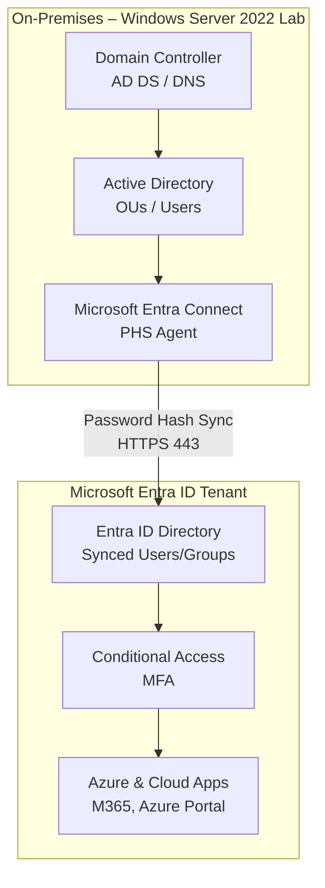

Infrastruktur läuft auf Azure (Resource Group `hybrid-identity-lab`, Region Germany
West Central): VM `vm-germany-ad-01`, zugehöriges VNet, NSG und Public IP.

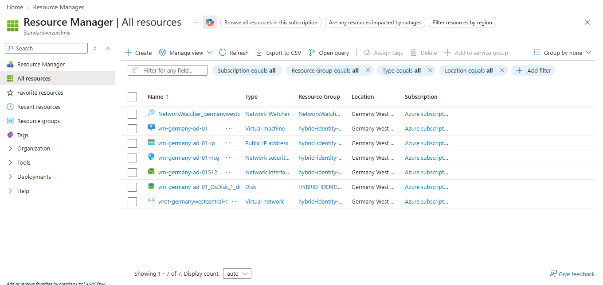
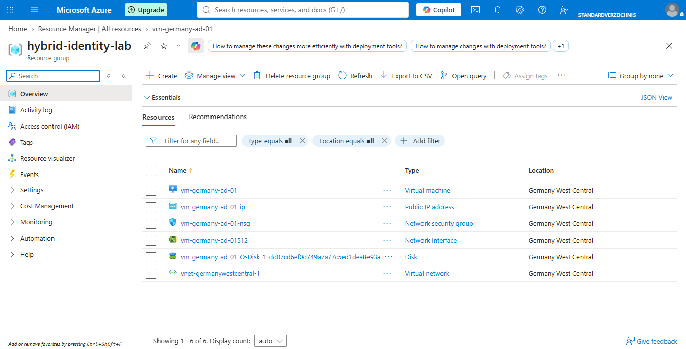

## Ziele

- [x] Microsoft Entra Connect Sync aufsetzen (PHS – Entscheidung dokumentiert, s.u.)
- [ ] Entra Hybrid Join für Windows-11-Client
- [ ] Conditional-Access-Policy (MFA-Enforcement)
- [ ] RBAC-Vergleich lokale AD-Gruppen vs. Entra-ID-Rollen
- [ ] Tagging- und Lock-Konzept auf Ressourcengruppen-Ebene
- [x] Troubleshooting-Runbook für Sync-Fehler (drei reale Fälle unten dokumentiert)

## Warum dieses Projekt

Bestehende Homelab-Komponenten (AD DS, Zammad-Ticketsystem) decken On-Premises-Themen
ab. Dieses Projekt schließt gezielt die Lücke zu Cloud-Identity-Management, das im
AZ-104-Examen einen der größten Gewichtsanteile hat.

## Setup

### Voraussetzungen

- Azure-Subscription (Free/Dev Tier ausreichend)
- Bestehendes AD DS Lab (siehe [it-infrastructure-lab](https://github.com/DFelux/it-infrastructure-lab))
- Windows Server mit .NET Framework 4.7.2+ für Entra Connect

### Installation – Schritt für Schritt

1. Microsoft Entra Connect auf der VM herunterladen und Setup starten
2. **Custom Installation** wählen (nicht Express – volle Sync-Regel-Kontrolle)
3. Im Schritt "Herstellen einer Verbindung mit Microsoft Entra ID" mit dem globalen
   Administrator-Konto anmelden

   

4. Lokales AD DS verbinden (Enterprise Admin-Anmeldedaten), betroffene OU auswählen
5. Anmeldekonfiguration (UPN-Suffix-Abgleich) prüfen und bestätigen

   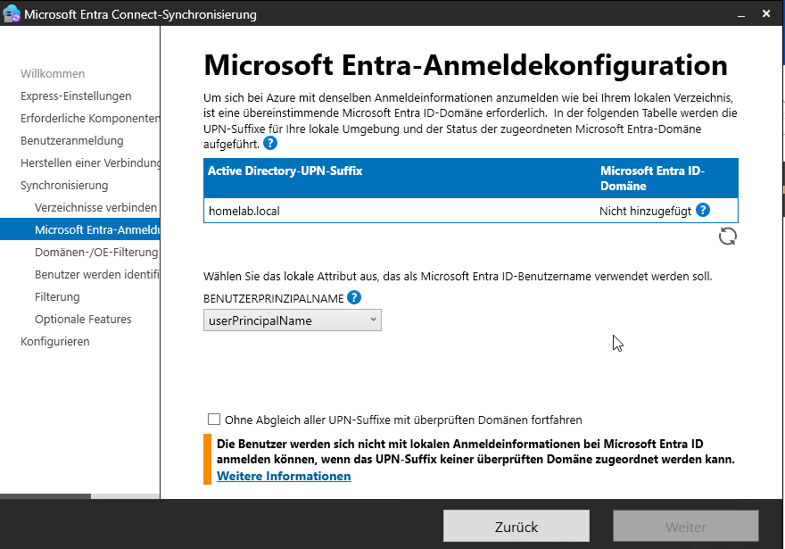

6. Benutzeridentifikation: Standardwerte (eindeutige Darstellung, Quellanker durch
   Azure verwalten) übernehmen

   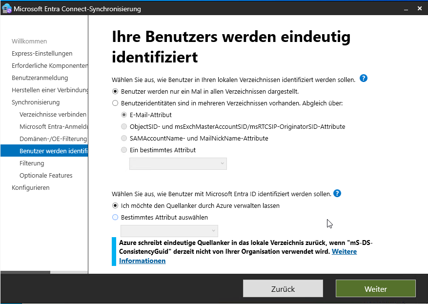

7. Optionale Features: **Kennwort-Hashsynchronisierung** aktiviert lassen, alle
   anderen Optionen (Password Writeback, Group Writeback etc.) für diese Phase
   deaktiviert lassen

   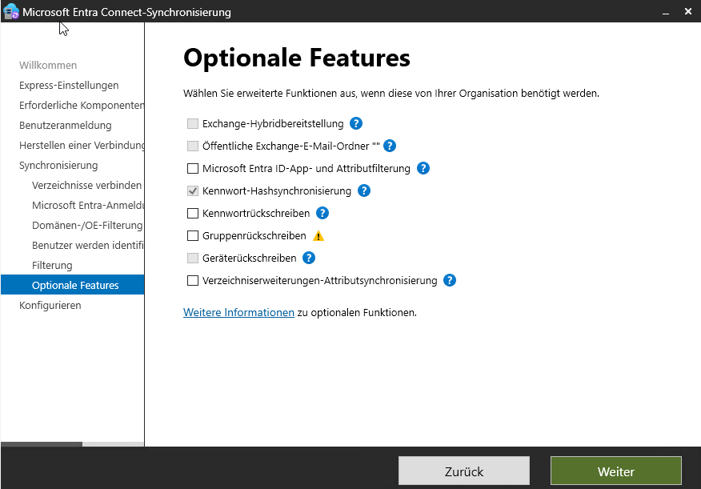

8. Konfiguration abschließen, Sync starten

## Entscheidung: PHS vs. PTA

| Kriterium                            | Password Hash Sync          | Pass-through Authentication              |
| ------------------------------------- | ---------------------------- | ------------------------------------------ |
| Ausfallsicherheit bei Azure-Störung  | Höher (Hash liegt in Cloud)  | Abhängig von Agent/On-Prem                |
| Infrastruktur-Overhead                | Gering                        | PTA-Agent-Server nötig                    |
| Bevorzugt für                         | Kleine/mittlere Umgebungen   | Umgebungen mit strikten On-Prem-Policies  |

**Entscheidung: Password Hash Synchronization (PHS).** Für dieses Homelab gibt es
keine regulatorische Anforderung, Passwort-Validierung strikt On-Prem zu halten.
PHS erfordert keinen zusätzlichen Agent-Server, ist der in der Praxis am
häufigsten eingesetzte Weg bei KMU und bietet zusätzlich Schutz durch
Microsofts "Leaked Credentials"-Erkennung. Federation (AD FS) wurde nicht in
Betracht gezogen, da der Infrastruktur- und Wartungsaufwand für dieses Lab-Szenario
nicht gerechtfertigt ist.

## Troubleshooting-Log

### 1. Verwechslung: Microsoft Entra Cloud Sync vs. klassisches Entra Connect

Beim ersten Versuch landete ich über einen falschen Menüpunkt im Entra Admin Center
auf der Konfigurationsseite für **Cloud Sync** statt der klassischen
**Entra-Connect-Sync**-Installation auf der VM. Cloud Sync nutzt einen separaten,
leichtgewichtigen Provisioning-Agent und unterstützt ausschließlich PHS – es gibt
dort keine PTA-/Federation-Auswahl.

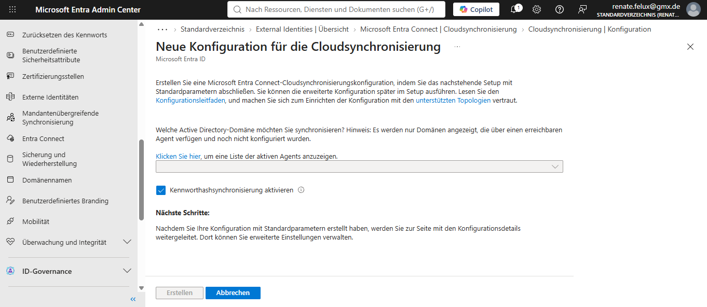

**Lösung:** Konfiguration abgebrochen, stattdessen den lokalen
Installationsassistenten auf der VM (Microsoft Entra Connect-Synchronisierung)
fortgesetzt.

### 2. Anmeldefehler AADSTS50020 – MSA statt natives Cloud-Konto

Der Installationsassistent akzeptierte das eingetragene Konto trotz Rolle
"Globaler Administrator" nicht:

```
AADSTS50020: User account '...' from identity provider 'live.com' does not
exist in tenant '' and cannot access the application
'cb1056e2-e479-49de-ae31-7812af012ed8' (Microsoft Azure Active Directory Connect)
in that tenant. The account needs to be added as an external user in the tenant
first.
```

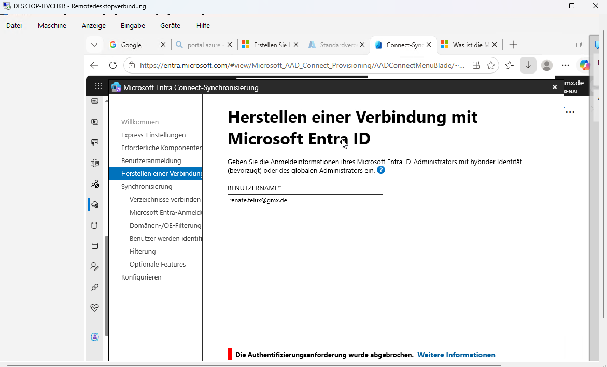

**Ursache:** Das Admin-Konto war technisch als **persönliches Microsoft-Konto (MSA,
Identity Provider `live.com`)** hinterlegt, nicht als natives Cloud-Konto des
Tenants. Die App-Registrierung "Microsoft Azure Active Directory Connect"
akzeptiert für diesen Anmeldeschritt keine MSA-gestützten Identitäten – unabhängig
von der zugewiesenen Rolle.

**Lösung:** Ein zusätzliches, rein cloud-natives Benutzerkonto direkt im Tenant
angelegt (Entra Admin Center → Users → New user), diesem die Rolle Global
Administrator zugewiesen und MFA über `aka.ms/mfasetup` registriert (Security
Defaults verlangen MFA für Admin-Konten). Mit diesem Konto lief die Anmeldung im
Assistenten fehlerfrei durch.

### 3. UPN-Suffix `homelab.local` nicht verifizierbar

Die Anmeldekonfiguration zeigte das lokale UPN-Suffix `homelab.local` als
**"Nicht hinzugefügt"** an eine Microsoft-Entra-Domäne an.


**Ursache:** `.local` ist eine nicht-routingfähige, interne Top-Level-Domain und
kann bei Microsoft grundsätzlich nicht als eigene Domain verifiziert werden – ein
bekanntes, in der Praxis häufiges Problem bei On-Prem-zu-Cloud-Migrationen, wenn
historisch mit internen `.local`/`.corp`-Domains gearbeitet wurde.

**Lösung:** Checkbox "Ohne Abgleich aller UPN-Suffixe mit überprüften Domänen
fortfahren" aktiviert. Konsequenz: Synchronisierte Benutzer werden automatisch auf
die Standard-`*.onmicrosoft.com`-Domain gemappt (z. B. `user@homelab.local` →
`user@<tenant>.onmicrosoft.com`), Anmeldung an Cloud-Diensten erfolgt über diese
Adresse.

### 4. SCP-Konfiguration: "Mindestens eine ausgewählte Gesamtstruktur weist keinen Authentifizierungsdienst oder keine Anmeldeinformationen eines Unternehmensadministrators auf"

**Symptom:** Trotz korrekt eingetragener `HOMELAB\Administrator`-Credentials
bricht der Assistent mit obiger Fehlermeldung ab.

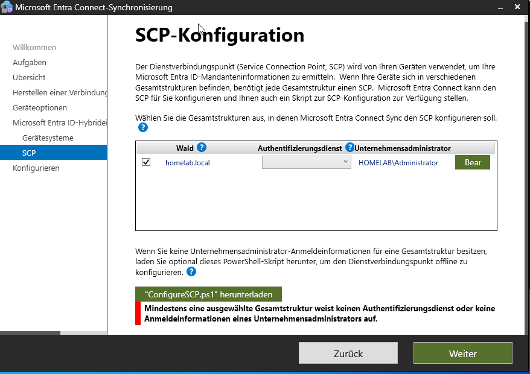

**Ursache:** Die Fehlermeldung deckt zwei unabhängige Bedingungen ab ("...oder...").
In diesem Fall waren die Credentials korrekt – tatsächlich fehlte die Auswahl im
Dropdown-Feld **"Authentifizierungsdienst"**, das standardmäßig leer bleibt und
leicht übersehen wird.

**Lösung:** Im SCP-Konfigurationsdialog das Dropdown "Authentifizierungsdienst"
auf **Entra ID** setzen (Standardwert für Setups ohne klassisches ADFS/Federation,
d. h. bei Password Hash Sync oder Pass-through Authentication).

## Microsoft Entra Connect – SCP-Konfiguration

### Ziel

Konfiguration des Service Connection Point (SCP) in der Configuration-Partition
des AD-Forests `homelab.local`, damit hybrid-eingebundene Geräte ihren
Microsoft Entra ID-Tenant automatisch ermitteln können.

### Voraussetzungen

- Mitgliedschaft in der Gruppe **Enterprise Admins** (nicht ausreichend: Domain Admin) –
  der SCP liegt in der forest-weiten Configuration-Partition, auf die Domain Admins
  standardmäßig keine Schreibrechte haben.
- Entra ID Global Administrator-Credentials für die Cloud-seitige Verknüpfung.

### Vorgelagerter Schritt: Optionale Features

Bei der Ersteinrichtung von Microsoft Entra Connect Sync wurde **Kennwort-Hashsynchronisierung**
aktiviert gelassen; alle anderen Optionen (Password Writeback, Group Writeback etc.)
blieben für diese Phase deaktiviert.

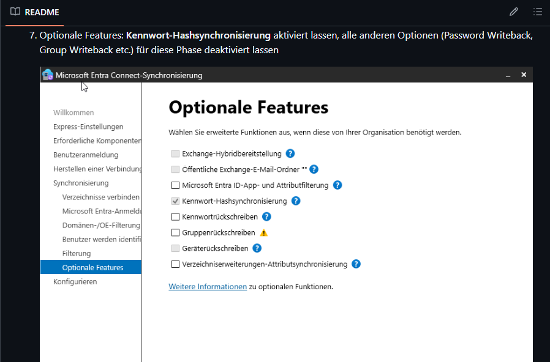

### Abschluss der Konfiguration

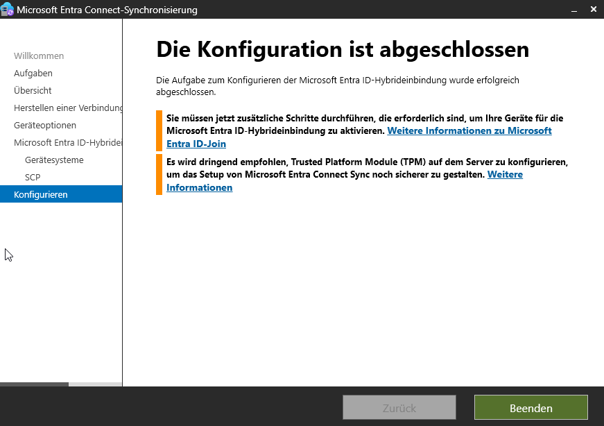

### Verifizierung

**SCP-Objekt in AD prüfen:**

```powershell
Get-ADObject -Filter {objectClass -eq "serviceConnectionPoint"} `
  -SearchBase "CN=Configuration,DC=homelab,DC=local"
```

**Sync-Status im Synchronization Service Manager:**

Full Import → Full Synchronization → Export, jeweils Status `success`
für beide Connectoren (`homelab.local` und den Cloud-Connector).

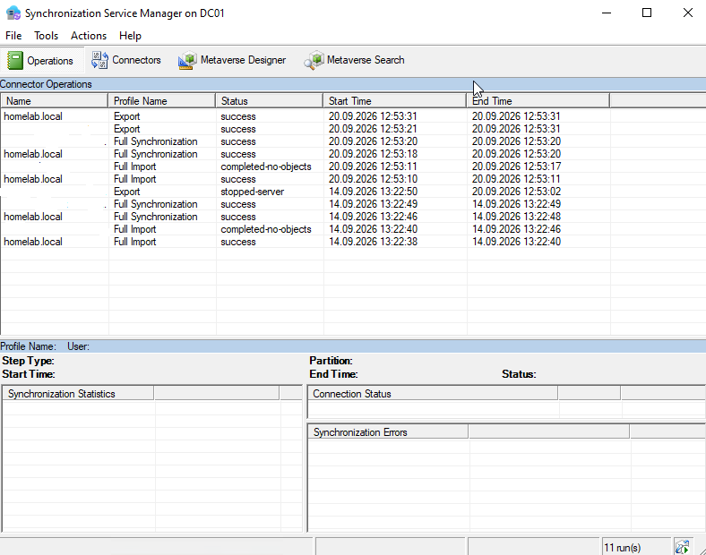

**Ankunft in Entra ID:**

Im Entra-Portal unter Identität → Benutzer → Alle Benutzer zeigt die Spalte
"On-premises sync" bei synchronisierten Objekten `Yes` – Unterscheidungsmerkmal
zwischen on-prem-synchronisierten und cloud-nativen Accounts.

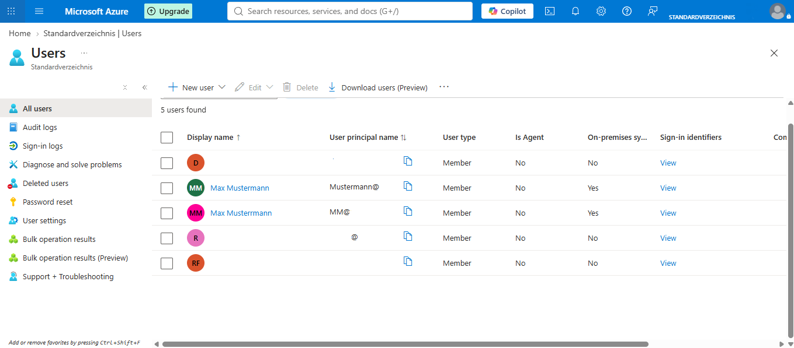

## Stack

`Windows Server 2022` · `AD DS` · `Microsoft Entra Connect` · `Entra ID` · `Conditional Access` · `PowerShell`

## Status

🚧 In Aufbau – Sync-Konfiguration und SCP abgeschlossen. Nächster Schritt: Entra
Hybrid Join für den Windows-11-Client.

## Bezug zu AZ-104

Dieses Projekt bildet praktisch folgende Skill-Areas der AZ-104-Prüfung ab:

- Manage Azure identities and governance
- Implement and manage governance (Tags, Locks)
- Monitor and maintain Azure resources (Sync-Health, Troubleshooting)
