# Hybrid Identity Lab – On-Prem AD DS ↔ Microsoft Entra ID

Erweiterung meines bestehenden Homelabs um eine hybride Identitätsanbindung zwischen
lokalem Active Directory und Microsoft Entra ID. Ziel: praktische Umsetzung der
AZ-104-Domäne "Identities & Governance" auf realer Infrastruktur, nicht nur in der
Theorie.

> Teil der [it-infrastructure-lab](https://github.com/DFelux/it-infrastructure-lab) Reihe.

## Architektur

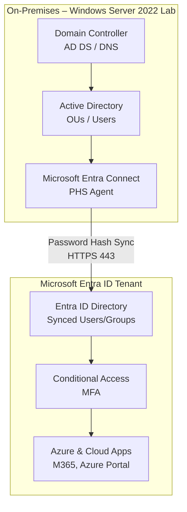
```mermaid
graph TD
    subgraph OnPrem["On-Premises – Windows Server 2022 Lab"]
        DC["Domain Controller<br/>AD DS / DNS"]
        OU["Active Directory<br/>OUs / Users"]
        EC["Microsoft Entra Connect<br/>PHS Agent"]
        DC --> OU
        OU --> EC
    end

    subgraph Cloud["Microsoft Entra ID Tenant"]
        EntraUsers["Entra ID Directory<br/>Synced Users/Groups"]
        CA["Conditional Access<br/>MFA"]
        Apps["Azure & Cloud Apps<br/>M365, Azure Portal"]
        EntraUsers --> CA
        CA --> Apps
    end

    EC -- "Password Hash Sync<br/>HTTPS 443" --> EntraUsers
```

Infrastruktur läuft auf Azure (Resource Group `hybrid-identity-lab`, Region Germany
West Central): VM `vm-germany-ad-01`, zugehöriges VNet, NSG und Public IP.

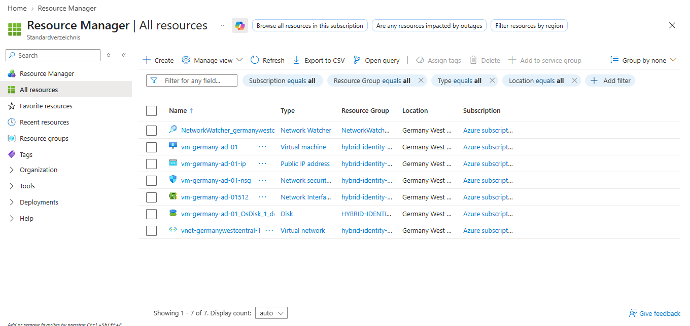
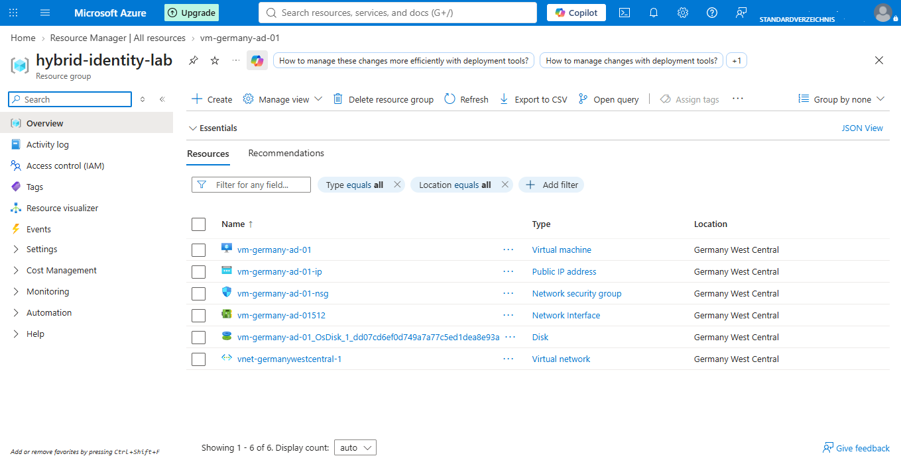

## Ziele

- [x] Microsoft Entra Connect Sync aufsetzen (PHS – Entscheidung dokumentiert, s.u.)
- [x] Entra Hybrid Join für Windows-11-Client
- [x] MFA-Enforcement via Security Defaults (Conditional Access erfordert P1-Lizenz, s.u.)
- [x] RBAC-Vergleich lokale AD-Gruppen vs. Entra-ID-Rollen
- [x] Tagging- und Lock-Konzept auf Ressourcengruppen-Ebene
- [x] Troubleshooting-Runbook für Sync-Fehler (vier reale Fälle unten dokumentiert)

## Warum dieses Projekt

Bestehende Homelab-Komponenten (AD DS, Zammad-Ticketsystem) decken On-Premises-Themen
ab. Dieses Projekt schließt gezielt die Lücke zu Cloud-Identity-Management, das im
AZ-104-Examen einen der größten Gewichtsanteile hat.

## Setup

### Voraussetzungen

- Azure-Subscription (Free/Dev Tier ausreichend)
- Bestehendes AD DS Lab (siehe [it-infrastructure-lab](https://github.com/DFelux/it-infrastructure-lab))
- Windows Server mit .NET Framework 4.7.2+ für Entra Connect

### Installation – Schritt für Schritt

1. Microsoft Entra Connect auf der VM herunterladen und Setup starten
2. **Custom Installation** wählen (nicht Express – volle Sync-Regel-Kontrolle)
3. Im Schritt "Herstellen einer Verbindung mit Microsoft Entra ID" mit dem globalen
   Administrator-Konto anmelden

   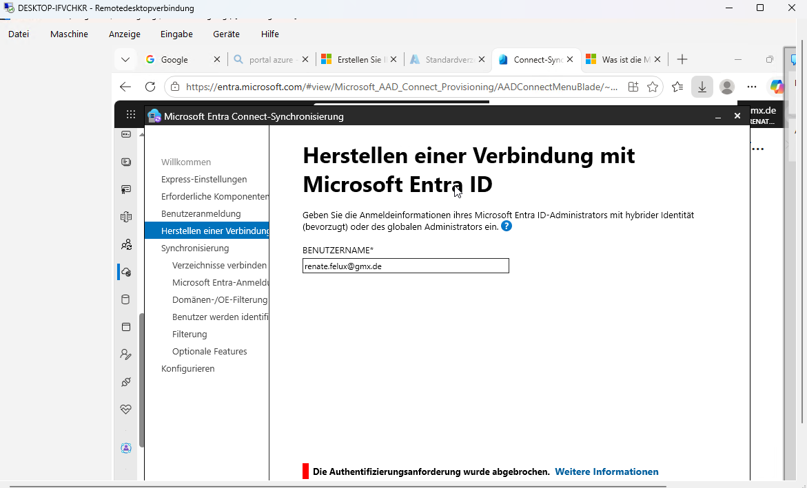

4. Lokales AD DS verbinden (Enterprise Admin-Anmeldedaten), betroffene OU auswählen
5. Anmeldekonfiguration (UPN-Suffix-Abgleich) prüfen und bestätigen

   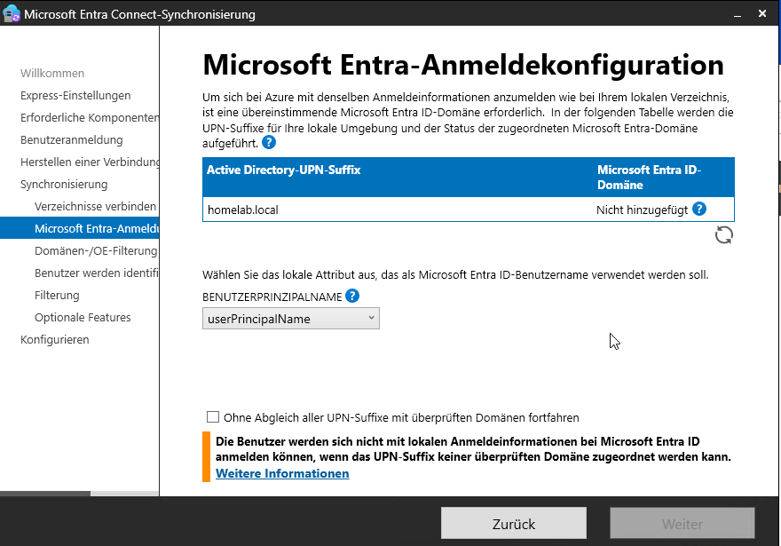

6. Benutzeridentifikation: Standardwerte (eindeutige Darstellung, Quellanker durch
   Azure verwalten) übernehmen

   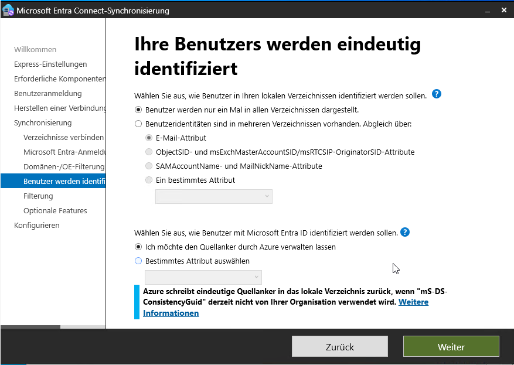

7. Optionale Features: **Kennwort-Hashsynchronisierung** aktiviert lassen, alle
   anderen Optionen (Password Writeback, Group Writeback etc.) für diese Phase
   deaktiviert lassen

   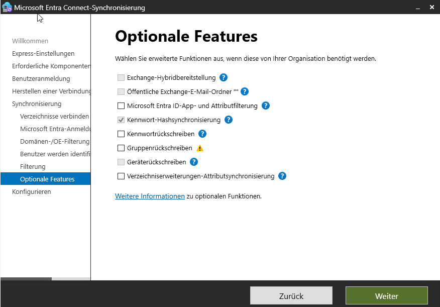

8. Konfiguration abschließen, Sync starten

## Entscheidung: PHS vs. PTA

| Kriterium                            | Password Hash Sync          | Pass-through Authentication              |
| ------------------------------------- | ---------------------------- | ------------------------------------------ |
| Ausfallsicherheit bei Azure-Störung  | Höher (Hash liegt in Cloud)  | Abhängig von Agent/On-Prem                |
| Infrastruktur-Overhead                | Gering                        | PTA-Agent-Server nötig                    |
| Bevorzugt für                         | Kleine/mittlere Umgebungen   | Umgebungen mit strikten On-Prem-Policies  |

**Entscheidung: Password Hash Synchronization (PHS).** Für dieses Homelab gibt es
keine regulatorische Anforderung, Passwort-Validierung strikt On-Prem zu halten.
PHS erfordert keinen zusätzlichen Agent-Server, ist der in der Praxis am
häufigsten eingesetzte Weg bei KMU und bietet zusätzlich Schutz durch
Microsofts "Leaked Credentials"-Erkennung. Federation (AD FS) wurde nicht in
Betracht gezogen, da der Infrastruktur- und Wartungsaufwand für dieses Lab-Szenario
nicht gerechtfertigt ist.

## Troubleshooting-Log

### 1. Verwechslung: Microsoft Entra Cloud Sync vs. klassisches Entra Connect

Beim ersten Versuch landete ich über einen falschen Menüpunkt im Entra Admin Center
auf der Konfigurationsseite für **Cloud Sync** statt der klassischen
**Entra-Connect-Sync**-Installation auf der VM. Cloud Sync nutzt einen separaten,
leichtgewichtigen Provisioning-Agent und unterstützt ausschließlich PHS – es gibt
dort keine PTA-/Federation-Auswahl.

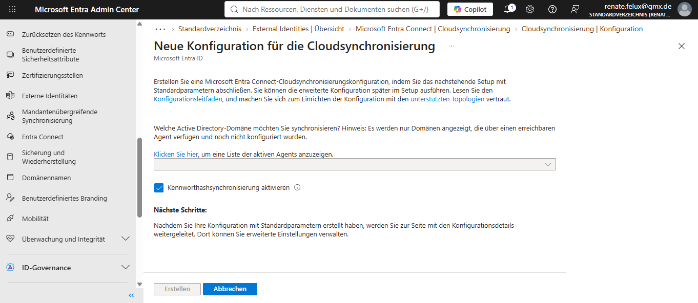

**Lösung:** Konfiguration abgebrochen, stattdessen den lokalen
Installationsassistenten auf der VM (Microsoft Entra Connect-Synchronisierung)
fortgesetzt.

### 2. Anmeldefehler AADSTS50020 – MSA statt natives Cloud-Konto

Der Installationsassistent akzeptierte das eingetragene Konto trotz Rolle
"Globaler Administrator" nicht:

```
AADSTS50020: User account '...' from identity provider 'live.com' does not
exist in tenant '' and cannot access the application
'cb1056e2-e479-49de-ae31-7812af012ed8' (Microsoft Azure Active Directory Connect)
in that tenant. The account needs to be added as an external user in the tenant
first.
```


**Ursache:** Das Admin-Konto war technisch als **persönliches Microsoft-Konto (MSA,
Identity Provider `live.com`)** hinterlegt, nicht als natives Cloud-Konto des
Tenants. Die App-Registrierung "Microsoft Azure Active Directory Connect"
akzeptiert für diesen Anmeldeschritt keine MSA-gestützten Identitäten – unabhängig
von der zugewiesenen Rolle.

**Lösung:** Ein zusätzliches, rein cloud-natives Benutzerkonto direkt im Tenant
angelegt (Entra Admin Center → Users → New user), diesem die Rolle Global
Administrator zugewiesen und MFA über `aka.ms/mfasetup` registriert (Security
Defaults verlangen MFA für Admin-Konten). Mit diesem Konto lief die Anmeldung im
Assistenten fehlerfrei durch.

### 3. UPN-Suffix `homelab.local` nicht verifizierbar

Die Anmeldekonfiguration zeigte das lokale UPN-Suffix `homelab.local` als
**"Nicht hinzugefügt"** an eine Microsoft-Entra-Domäne an.


**Ursache:** `.local` ist eine nicht-routingfähige, interne Top-Level-Domain und
kann bei Microsoft grundsätzlich nicht als eigene Domain verifiziert werden – ein
bekanntes, in der Praxis häufiges Problem bei On-Prem-zu-Cloud-Migrationen, wenn
historisch mit internen `.local`/`.corp`-Domains gearbeitet wurde.

**Lösung:** Checkbox "Ohne Abgleich aller UPN-Suffixe mit überprüften Domänen
fortfahren" aktiviert. Konsequenz: Synchronisierte Benutzer werden automatisch auf
die Standard-`*.onmicrosoft.com`-Domain gemappt (z. B. `user@homelab.local` →
`user@<tenant>.onmicrosoft.com`), Anmeldung an Cloud-Diensten erfolgt über diese
Adresse.

### 4. SCP-Konfiguration: "Mindestens eine ausgewählte Gesamtstruktur weist keinen Authentifizierungsdienst oder keine Anmeldeinformationen eines Unternehmensadministrators auf"

**Symptom:** Trotz korrekt eingetragener `HOMELAB\Administrator`-Credentials
bricht der Assistent mit obiger Fehlermeldung ab.

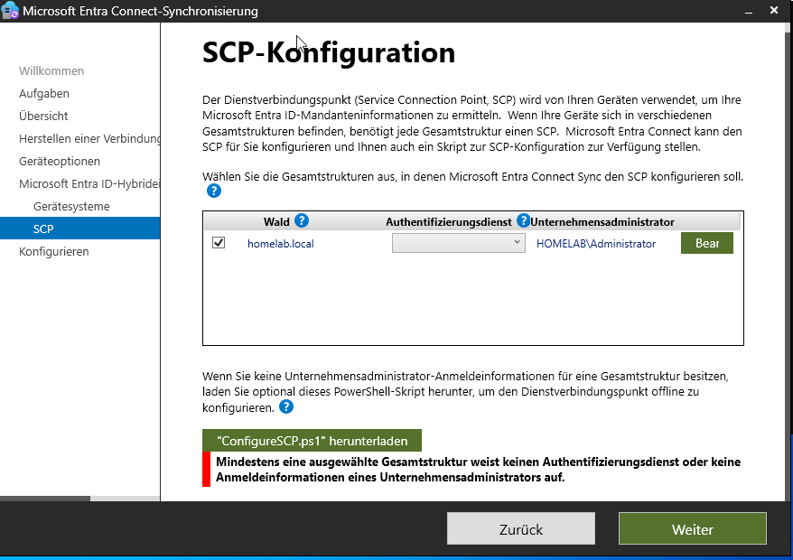

**Ursache:** Die Fehlermeldung deckt zwei unabhängige Bedingungen ab ("...oder...").
In diesem Fall waren die Credentials korrekt – tatsächlich fehlte die Auswahl im
Dropdown-Feld **"Authentifizierungsdienst"**, das standardmäßig leer bleibt und
leicht übersehen wird.

**Lösung:** Im SCP-Konfigurationsdialog das Dropdown "Authentifizierungsdienst"
auf **Entra ID** setzen (Standardwert für Setups ohne klassisches ADFS/Federation,
d. h. bei Password Hash Sync oder Pass-through Authentication).

### 5. Entra Hybrid Join des Windows-11-Clients schlägt fehl (0x80072ee7 – DNS/Internet)

**Symptom:** Nach erfolgreichem Durchlauf des "Configure device options"-Wizards
(SCP erfolgreich angelegt) blieb der Windows 11 Client trotz mehrfach angestoßenem
Sync-Zyklus und manuell getriggertem `Automatic-Device-Join`-Task im Zustand
`AzureAdJoined: NO`.

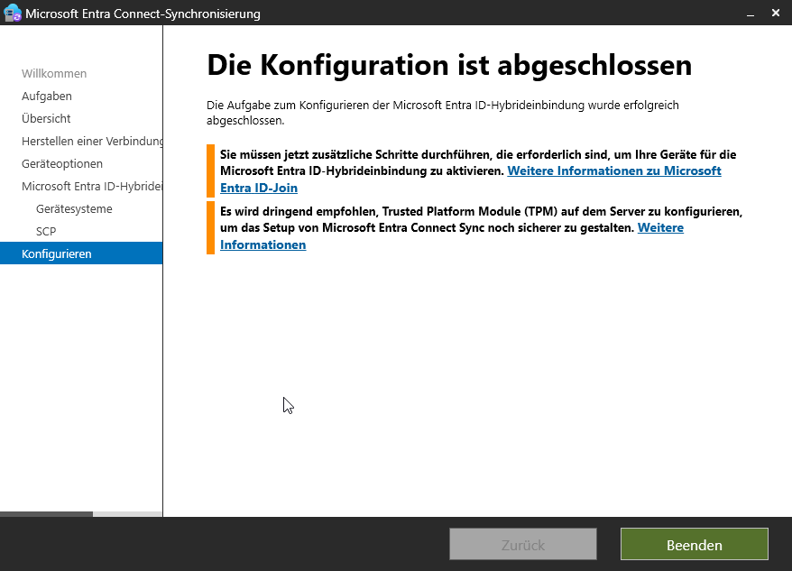

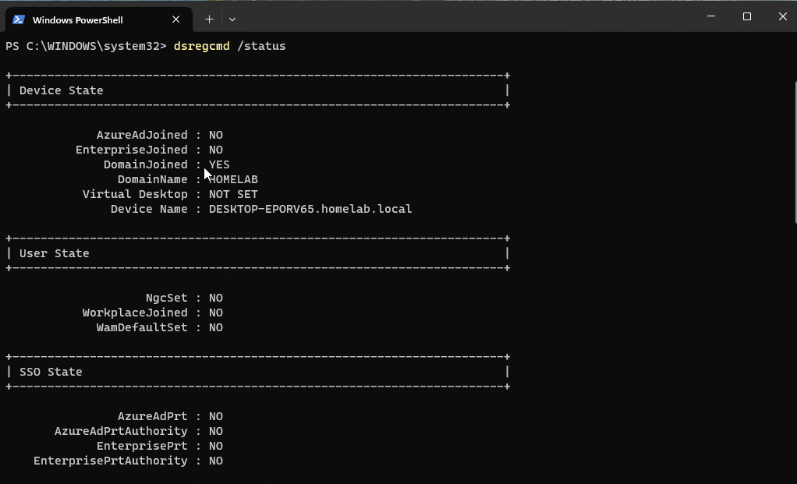

**Diagnose Schritt 1 – Task-Ausführung geprüft:**

```powershell
schtasks /run /tn "\Microsoft\Windows\Workplace Join\Automatic-Device-Join"
```

Task lief laut `Get-ScheduledTaskInfo` erfolgreich (`LastTaskResult: 0`) – der
Join selbst schlug aber weiterhin fehl. Das zeigte, dass der Fehler nicht im
Task-Trigger, sondern im eigentlichen Registrierungsversuch lag.

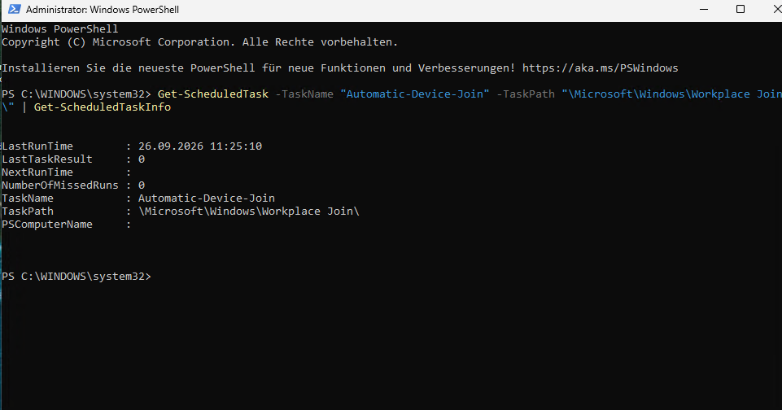

**Diagnose Schritt 2 – Eventlog ausgewertet:**

```
Ereignisanzeige → Anwendungs- und Dienstprotokolle → Microsoft → Windows →
User Device Registration → Admin
```

Ereignis-ID 201 lieferte die entscheidende Fehlermeldung:

```
Fehler für den Rückruf des Ermittlungsvorgangs mit Exitcode: Unknown HResult Error code: 0x80072ee7.
Server gab folgenden HTTP-Status zurück: 0.
```

`0x80072ee7` = `WININET_E_NAME_NOT_RESOLVED` – der Client konnte den Discovery-
Endpoint `enterpriseregistration.windows.net` nicht auflösen bzw. erreichen.

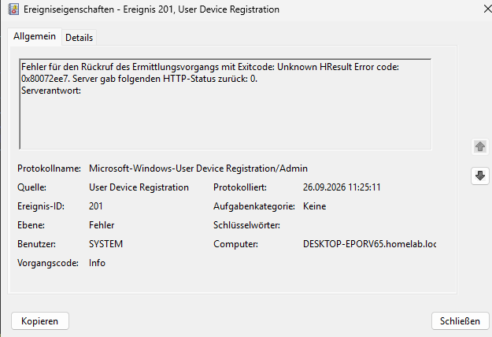

**Root Cause:**

```powershell
ipconfig /all
```

zeigte, dass der Client zwar eine gültige IP und DNS-Server-Eintrag (interner DC)
hatte, aber **kein Standardgateway** konfiguriert war.

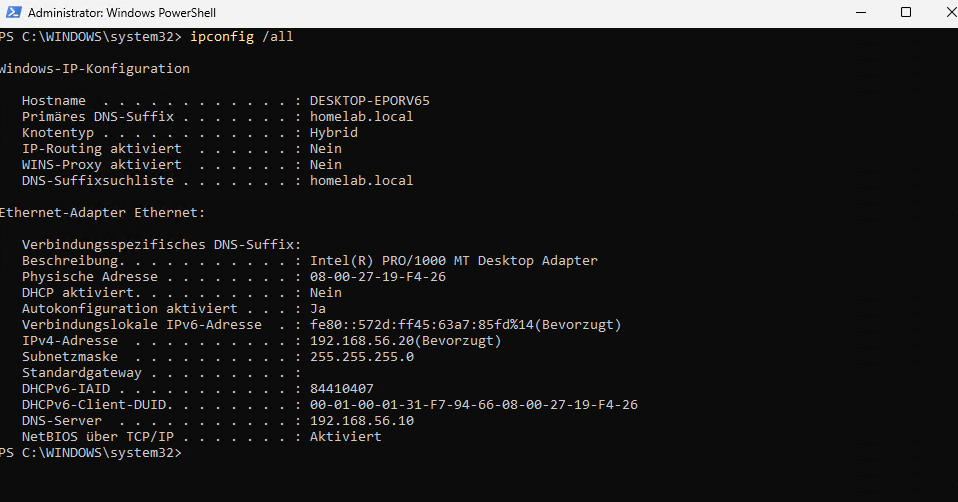

Ursache: Der VirtualBox-Netzwerkadapter der Client-VM war ausschließlich als
**Host-Only-Adapter** konfiguriert. Dieser verbindet VMs untereinander sowie mit
dem Host, stellt aber standardmäßig kein Gateway ins Internet bereit –
Namensauflösung zum internen DC funktionierte, externe Erreichbarkeit (Microsoft
Entra Discovery-Endpoints) jedoch nicht.

**Lösung:** Zweiten Netzwerkadapter mit **NAT** an der Client-VM ergänzt
(VirtualBox → VM-Einstellungen → Netzwerk → Adapter 2 → Angeschlossen an: NAT),
um parallel zur internen Host-Only-Verbindung Internetzugang bereitzustellen.

**Verifikation:**

```powershell
Test-NetConnection enterpriseregistration.windows.net -Port 443
schtasks /run /tn "\Microsoft\Windows\Workplace Join\Automatic-Device-Join"
dsregcmd /status
```

Ergebnis:

```
AzureAdJoined : YES
DomainJoined  : YES
DeviceAuthStatus : SUCCESS
```

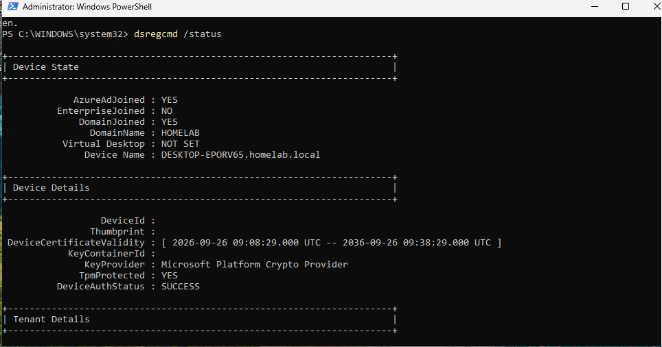

Zusätzlich im Microsoft Entra Admin Center unter **Devices → All devices**
bestätigt: beide Geräte (Client und DC) erscheinen mit Join type **Microsoft
Entra hybrid joined**.

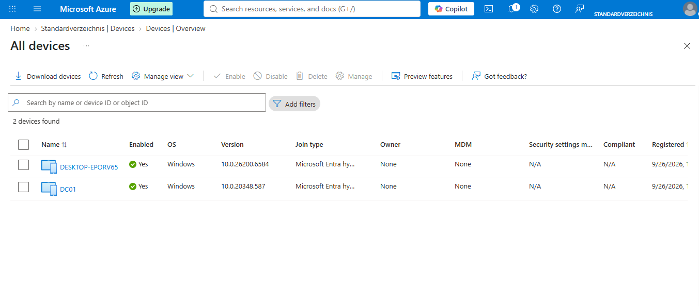

**Lessons Learned:** Ein erfolgreicher Task-Lauf (`LastTaskResult: 0`) bedeutet
nur, dass der Trigger ausgeführt wurde – nicht, dass der eigentliche
Registrierungsprozess erfolgreich war. Für die tatsächliche Fehlerursache ist das
Eventlog unter `User Device Registration` die zuverlässigste Quelle. In
verschachtelten Lab-Umgebungen mit mehreren VMs lohnt sich außerdem früh die
Trennung von Adaptern: ein Host-Only/Internes-Netz-Adapter für die
Domain-Kommunikation, ein separater NAT-Adapter für Internetzugang – statt beides
über eine einzige Schnittstelle abzudecken.

## MFA-Enforcement: Security Defaults statt Conditional Access

### Ausgangslage

Ursprünglich geplant war eine **Conditional-Access-Policy** mit granularem Targeting
(Testgruppe, Cloud-Apps, Grant-Control "Require MFA"). Beim Anlegen der Policy im
Entra Admin Center erschien jedoch folgender Hinweis:

> "Create your own policies and target specific conditions like cloud apps,
> sign-in risk, and device platforms with Microsoft Entra ID Premium. Your
> organization does not have sufficient licensing to access this product."

**Ursache:** Conditional Access ist ein **Microsoft Entra ID P1**-Feature und im
kostenlosen Free Tier nicht enthalten. Sowohl die reguläre P1-Lizenz als auch die
30-Tage-Testversion verlangen ein hinterlegtes Zahlungsmittel zur Verifizierung
(auch wenn im Trial-Zeitraum nichts abgebucht wird). Das früher gängige
Ausweichmittel – ein kostenloses Microsoft-365-Developer-Sandbox-Tenant (E5, ohne
Kreditkarte) – ist seit 2024 auf Visual-Studio-Abonnenten und
Partner-Programm-Mitglieder beschränkt und für Einzelpersonen ohne diese
Voraussetzungen nicht mehr zugänglich.

### Entscheidung

Für dieses Homelab wurde bewusst **keine Kreditkarte hinterlegt**, um im Free Tier
zu bleiben. Stattdessen wurde **Security Defaults** aktiviert – Microsofts
kostenlose, tenant-weite MFA-Baseline.

| Kriterium                          | Conditional Access (P1)                          | Security Defaults (Free)                  |
| ----------------------------------- | -------------------------------------------------- | -------------------------------------------- |
| Kosten                              | Lizenzpflichtig                                    | Kostenlos, im Free Tier enthalten           |
| Granularität                        | Gruppen-, App-, Device- und Risiko-basiert         | Tenant-weit, keine Ausnahmen konfigurierbar |
| MFA-Erzwingung                      | Konfigurierbar (Grant Control)                     | Für alle Nutzer, "one-size-fits-all"        |
| Legacy-Auth blockieren              | Über Policy steuerbar                              | Automatisch für den gesamten Tenant          |
| Einsatzzweck                        | Unternehmen mit differenzierten Zugriffsanforderungen | Kleine Umgebungen ohne P1/P2-Lizenz         |

### Umsetzung

1. **Entra Admin Center → Identity → Properties → Manage security defaults**
2. Toggle auf **Enabled** gesetzt

3. Mit dem separaten Testkonto angemeldet → sofortige Aufforderung zur
   MFA-Registrierung ("Aktion erforderlich – Sicherheitsstandardwerte sind
   aktiviert")

   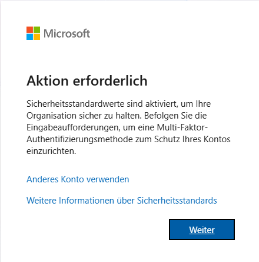

4. Registrierung über **Microsoft Authenticator** abgeschlossen

   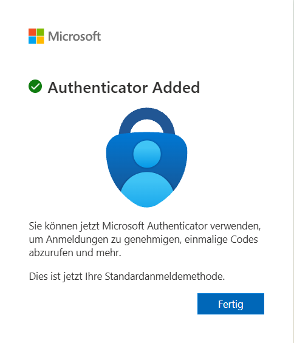

### Verifikation

Erneute Anmeldung mit demselben Testkonto: Nach Passworteingabe erscheint der
**Number-Matching-Prompt** (Schutz gegen MFA-Fatigue/Push-Bombing) – die
angezeigte Zahl muss in der Authenticator-App bestätigt werden.

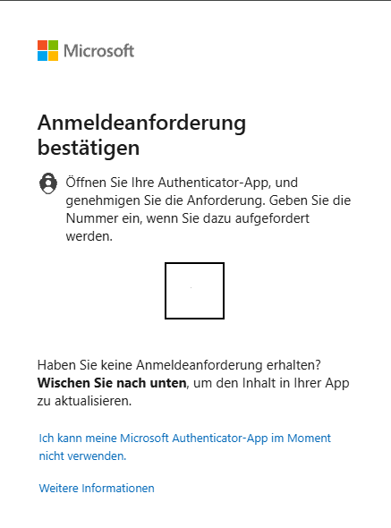

Damit ist bestätigt, dass MFA nicht nur bei der Erstregistrierung, sondern bei
jeder folgenden Anmeldung aktiv durchgesetzt wird.

### Lessons Learned

- Lizenzgrenzen sind Teil des realen Cloud-Alltags – nicht jede Enterprise-Funktion
  ist im Free Tier verfügbar, und Trial-Mechanismen sind bewusst so gestaltet
  (Zahlungsmittel-Pflicht), dass sie Missbrauch erschweren.
- Security Defaults sind für kleine Umgebungen ein legitimer, kostenloser
  MFA-Baseline-Schutz, ersetzen aber keine differenzierte Zugriffssteuerung.
  Conditional Access bleibt der nächste konzeptionelle Schritt, sobald eine P1-Test-
  oder -Produktivlizenz verfügbar ist (Umsetzung dann analog zu diesem Abschnitt,
  nur mit Gruppen-/App-Targeting statt Tenant-weiter Regel).

## RBAC-Vergleich: Lokale AD-Sicherheitsgruppen vs. Azure RBAC

### Konzept

Lokale AD-Sicherheitsgruppen und Azure RBAC lösen dasselbe Grundproblem
(Zugriffssteuerung über Gruppen-/Rollenzuweisung statt individueller Berechtigungen),
unterscheiden sich aber deutlich in Scope, Granularität und Vererbungsmodell:

| Kriterium | Lokale AD-Sicherheitsgruppen | Azure RBAC |
| --- | --- | --- |
| Scope | Domäne/OU, über ACLs auf Objekten | Management Group / Subscription / Resource Group / Resource |
| Vererbung | Über OU-Struktur | Über Ressourcenhierarchie (nach unten vererbt) |
| Verwaltung | Gruppenmitgliedschaft + Berechtigungen auf Objekten/Freigaben | Rollen-Definitionen (integriert oder custom) + Zuweisung auf Scope |
| Granularität | Grob (Lese/Schreib/Vollzugriff je Objekt) | Fein (rollenspezifische Aktionen, z. B. nur VM-Neustart erlauben) |
| Identitäts-Ursprung | Rein On-Prem (AD-Objekt-SID) | Entra ID-Objekt (kann synced oder cloud-nativ sein) |

### Praktischer Test 1: Integrierte Reader-Rolle

Dem Testkonto (`d`) wurde auf der Resource
Group `hybrid-identity-lab` die integrierte Rolle **Reader** zugewiesen.

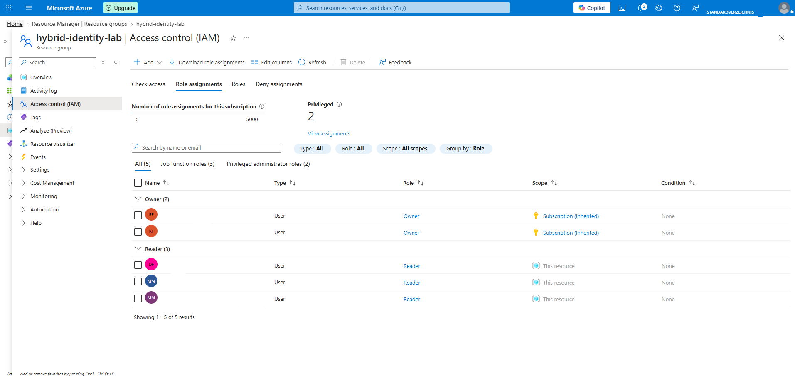

**Lesezugriff (erwartet: erfolgreich):** Anmeldung mit dem Testkonto, Navigation zur
Resource Group – alle Ressourcen (VM, NSG, VNet, Public IP) sind sichtbar.

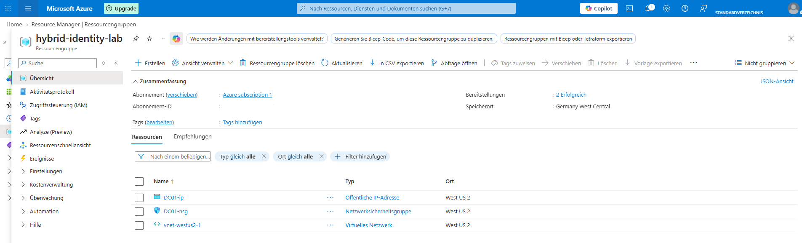

**Schreibzugriff (erwartet: blockiert):** Versuch, eine Deployment-Validierung
auszulösen, schlägt korrekt mit `AuthorizationFailed` fehl:

```
Der Client "d" ... verfügt über keine
Autorisierung zum Ausführen der Aktion
"Microsoft.Resources/deployments/validate/action" über den Bereich "...". (Code:
AuthorizationFailed)
```

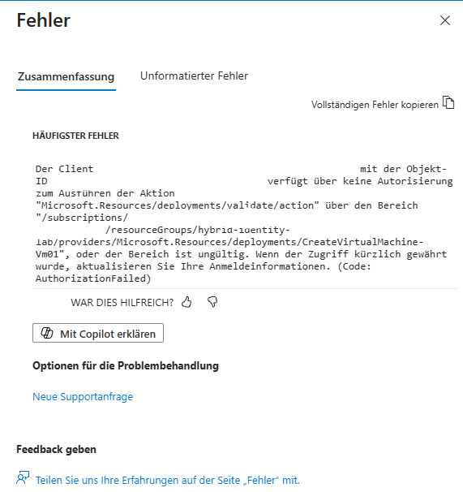

### Praktischer Test 2: Custom Role "VM Restart Operator"

Um "least privilege" konkreter zu demonstrieren als mit einer eingebauten Rolle,
wurde eine **Custom Role** definiert, die ausschließlich das Neustarten von VMs
erlaubt – kein Löschen, keine Konfigurationsänderung, keine Neuerstellung.

**Rollendefinition:**

```json
{
  "Name": "VM Restart Operator",
  "IsCustom": true,
  "Description": "Kann virtuelle Maschinen neu starten, aber nicht loeschen, aendern oder neu erstellen.",
  "Permissions": [
    {
      "Actions": [
        "Microsoft.Compute/virtualMachines/read",
        "Microsoft.Compute/virtualMachines/restart/action",
        "Microsoft.Compute/virtualMachines/instanceView/read"
      ]
    }
  ],
  "AssignableScopes": [
    "/subscriptions/d0c1660b-5377-4ac8-aa99-6eeb97a86121"
  ]
}
```

**Erstellung:**
```powershell
New-AzRoleDefinition -InputFile "vm-restart-operator.json"
```

**Troubleshooting bei der Erstellung:** Der erste Versuch schlug mit
`Invalid value for Permissions` fehl, obwohl das ältere, flache JSON-Format
(`Actions` auf oberster Ebene statt in einem `Permissions`-Array) verwendet wurde.
Ursache: Die installierte Az.Resources-Modulversion erwartet bereits das neue,
verschachtelte `Permissions`-Array-Format, obwohl die Cmdlet-Warnung dieses Format
offiziell erst für Az-Version 16.0.0 ankündigt. Nach Anpassung auf das
`Permissions`-Array-Format lief die Erstellung durch – der zunächst weiterhin
angezeigte Fehler stellte sich als bereits erfolgreich anlegte Rolle heraus
(`RoleDefinitionWithSameNameExists` beim erneuten Ausführen), verifiziert über:

```powershell
Get-AzRoleDefinition -Name "VM Restart Operator"
(Get-AzRoleDefinition -Name "VM Restart Operator").Permissions.Actions
```

**Zuweisung** analog zur Reader-Rolle über IAM → Add role assignment.

**Test 1 – Neustart (erwartet: erfolgreich):**

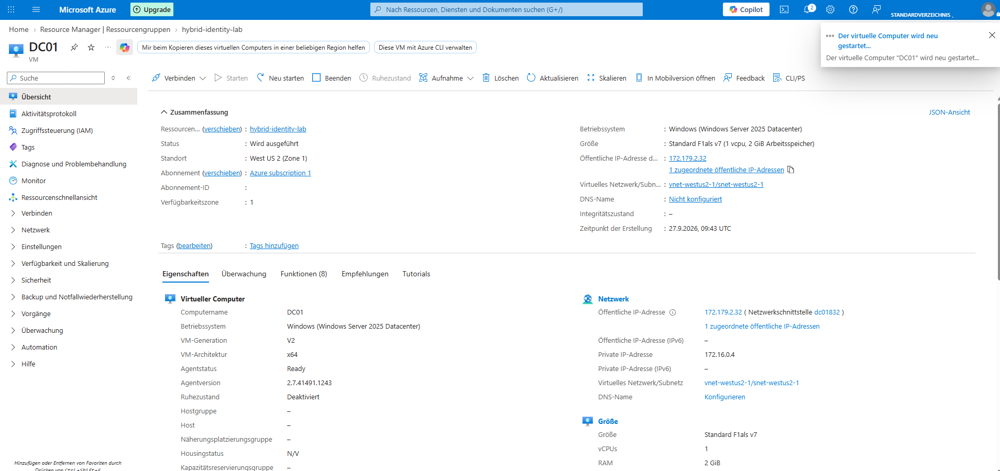

**Test 2 – Löschen (erwartet: blockiert):** Der Löschdialog selbst öffnet sich noch
(reine Read-Operation), das eigentliche Löschen scheitert jedoch präzise an der
fehlenden Berechtigung für die zugeordnete Netzwerkschnittstelle:

```
Der Client "d" ... verfügt über keine
Autorisierung zum Ausführen der Aktion "Microsoft.Network/networkInterfaces/write"
über den Bereich "...". (Code: AuthorizationFailed)
```

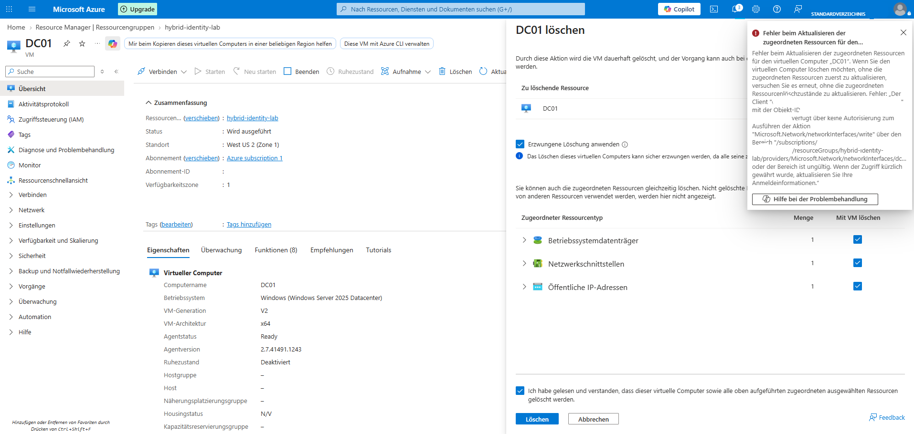

### Lessons Learned

- Die genaue Fehlermeldung bei `AuthorizationFailed` benennt exakt die fehlende
  Control-Plane-Action (z. B. `Microsoft.Network/networkInterfaces/write`) – das
  macht Custom Roles gut debugbar, da man direkt sieht, welche Action noch fehlt,
  falls eine geplante Funktion nicht wie erwartet funktioniert.
- Breaking-Change-Warnungen von Azure-PowerShell-Cmdlets sollten ernst genommen
  werden, auch wenn sie ein zukünftiges Datum nennen – in der Praxis kann die
  tatsächlich installierte Modulversion das neue Verhalten bereits vorab
  erzwingen.
- Im Gegensatz zu lokalen AD-Gruppen (grobe Berechtigungsstufen pro Objekt) lässt
  sich mit Azure Custom Roles sehr präzise "kann X tun, aber nicht Y" abbilden –
  praktisch relevant für Rollen wie Helpdesk (VM neu starten) ohne
  Administrator-Rechte.

## Governance: Tagging- und Lock-Konzept

### Ziel

Konsistente Kategorisierung der Ressourcengruppe über Tags sowie Schutz vor
versehentlichem Löschen über einen Resource Lock – beides Kernthemen der AZ-104-
Domäne "Implement and manage governance".

### Tags

Auf der Resource Group `hybrid-identity-lab` wurden drei Tags per PowerShell
gesetzt:

```powershell
$tags = @{Environment="Lab"; Project="hybrid-identity-lab"; Owner="DFelux"}
Update-AzTag -ResourceId "/subscriptions/-/resourceGroups/hybrid-identity-lab" -Tag $tags -Operation Merge
```

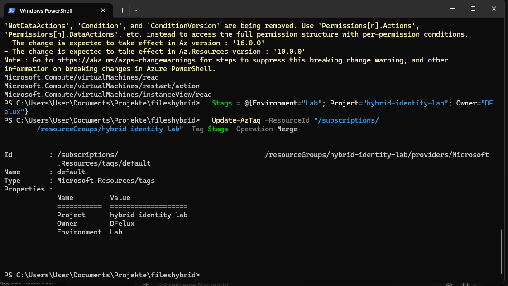

**Verifikation** subscription-weit über die zentrale Tags-Übersicht (Resource
Manager → Tags) – zeigt zusätzlich, dass Tags nicht nur lokal an der Ressource
hängen, sondern für konsolidierte Filterung/Kostenanalyse über die gesamte
Subscription nutzbar sind:

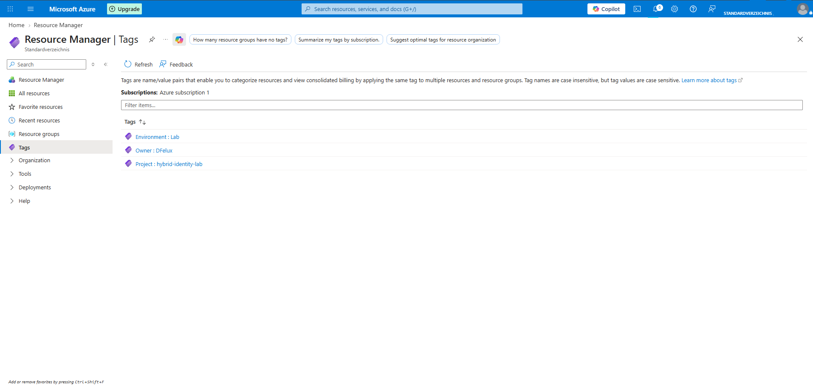

### Resource Lock

Ein **Delete-Lock** (`PreventAccidentalDelete`) wurde auf Resource-Group-Ebene
gesetzt, um versehentliches Löschen während der aktiven Lab-Entwicklung zu
verhindern:

```
Resource Group hybrid-identity-lab → Locks → + Add
Lock name: PreventAccidentalDelete
Lock type: Delete
```

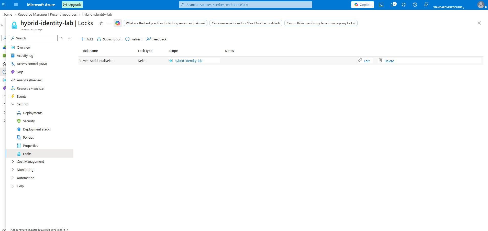

### Verifikation

**Kontrast-Test – normale Operationen bleiben möglich:** Ein VM-Neustart wurde
trotz aktivem Delete-Lock erfolgreich ausgeführt (Lock blockiert nur
Löschvorgänge, keine sonstigen Schreiboperationen):

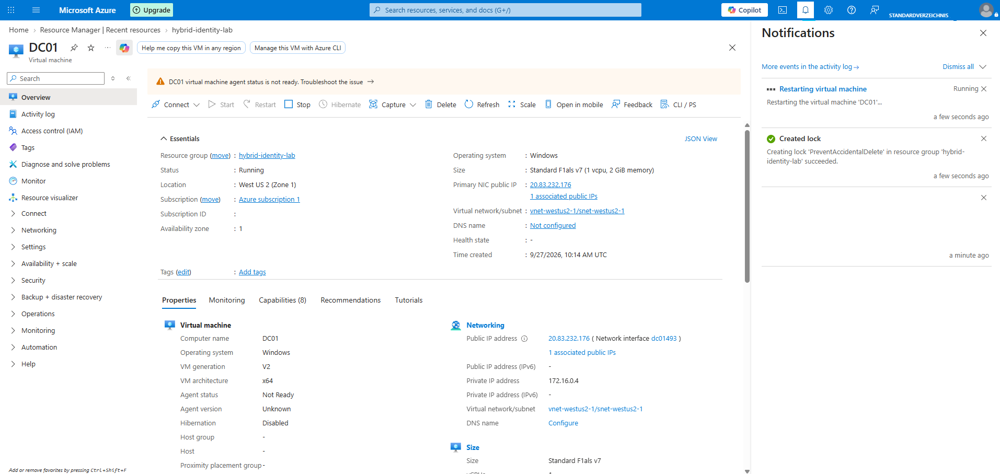

**Blockade-Test:** Der Versuch, die gesamte Resource Group zu löschen, schlägt
korrekt fehl:

```
Delete resource group hybrid-identity-lab failed
The resource group hybrid-identity-lab is locked and can't be deleted.
```

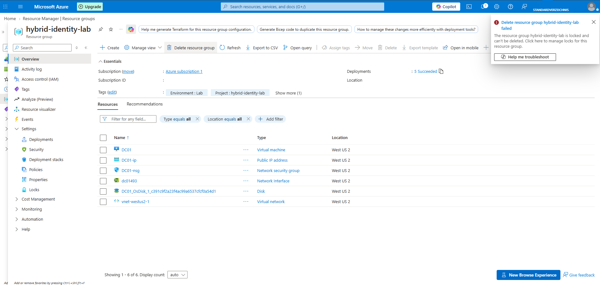

### Lessons Learned

- Ein direkter Löschversuch der VM selbst (statt der Resource Group) führte
  zunächst zu einem anderen, irreführenden Fehler (`PutNicOperation was canceled
  and superseded`) – verursacht durch eine noch laufende Neustart-Operation zum
  Testzeitpunkt, nicht durch den Lock selbst. Für einen eindeutigen Lock-Nachweis
  ist es sauberer, den Löschversuch auf **Resource-Group-Ebene** zu testen, statt
  auf eine einzelne, gerade aktive Ressource.
- Locks sind orthogonal zu RBAC: Ein Nutzer mit vollem Zugriff (z. B. Owner) kann
  durch einen Lock trotzdem am Löschen gehindert werden – das ist eine
  zusätzliche Schutzebene, keine Berechtigungssteuerung. Beide Mechanismen
  ergänzen sich in einer durchdachten Governance-Strategie.

## Microsoft Entra Connect – SCP-Konfiguration

### Ziel

Konfiguration des Service Connection Point (SCP) in der Configuration-Partition
des AD-Forests `homelab.local`, damit hybrid-eingebundene Geräte ihren
Microsoft Entra ID-Tenant automatisch ermitteln können.

### Voraussetzungen

- Mitgliedschaft in der Gruppe **Enterprise Admins** (nicht ausreichend: Domain Admin) –
  der SCP liegt in der forest-weiten Configuration-Partition, auf die Domain Admins
  standardmäßig keine Schreibrechte haben.
- Entra ID Global Administrator-Credentials für die Cloud-seitige Verknüpfung.

### Vorgelagerter Schritt: Optionale Features

Bei der Ersteinrichtung von Microsoft Entra Connect Sync wurde **Kennwort-Hashsynchronisierung**
aktiviert gelassen; alle anderen Optionen (Password Writeback, Group Writeback etc.)
blieben für diese Phase deaktiviert.

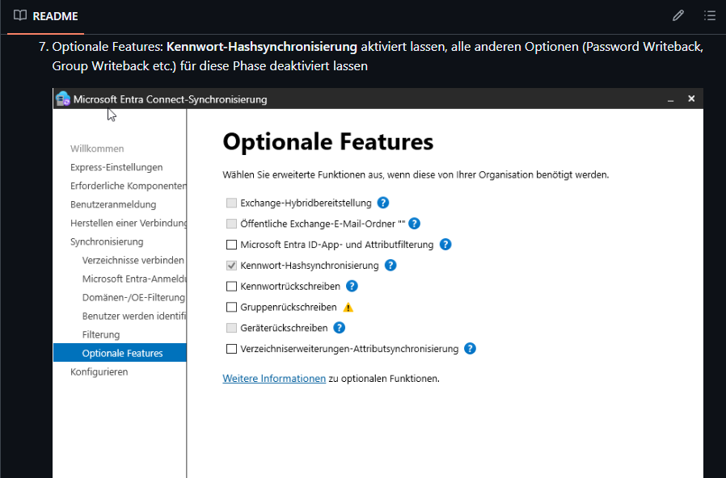

### Abschluss der Konfiguration

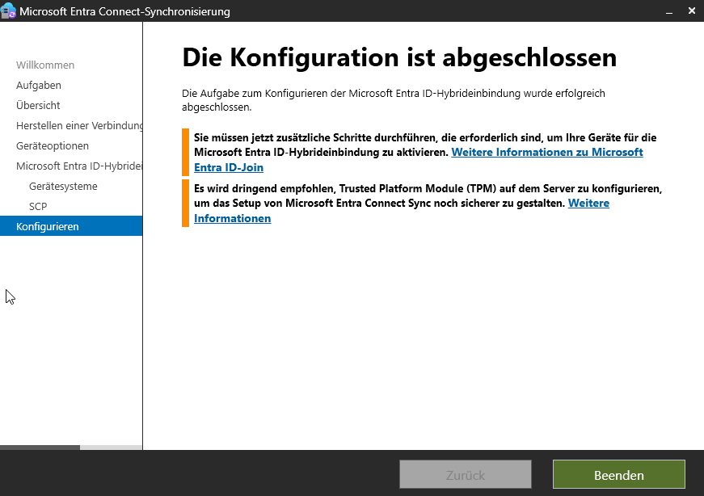

### Verifizierung

**SCP-Objekt in AD prüfen:**

```powershell
Get-ADObject -Filter {objectClass -eq "serviceConnectionPoint"} `
  -SearchBase "CN=Configuration,DC=homelab,DC=local"
```

**Sync-Status im Synchronization Service Manager:**

Full Import → Full Synchronization → Export, jeweils Status `success`
für beide Connectoren (`homelab.local` und den Cloud-Connector).

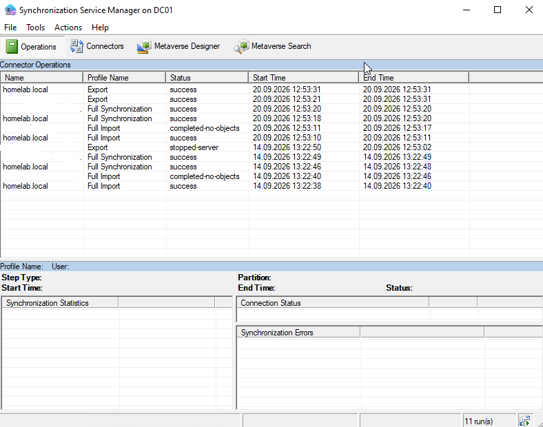

**Ankunft in Entra ID:**

Im Entra-Portal unter Identität → Benutzer → Alle Benutzer zeigt die Spalte
"On-premises sync" bei synchronisierten Objekten `Yes` – Unterscheidungsmerkmal
zwischen on-prem-synchronisierten und cloud-nativen Accounts.

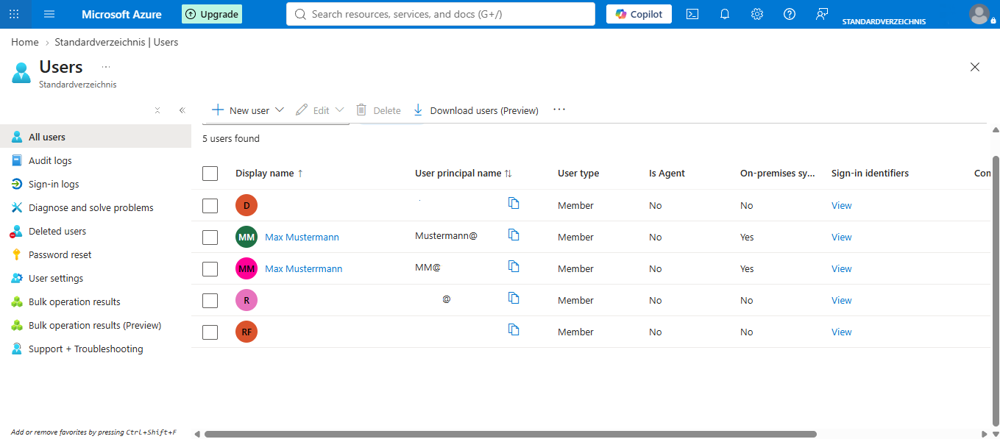

## Stack

`Windows Server 2022` · `AD DS` · `Microsoft Entra Connect` · `Entra ID` · `Conditional Access` · `PowerShell`

## Status

✅ Alle geplanten Ziele abgeschlossen: Sync-Konfiguration, SCP, Entra Hybrid Join
für den Windows-11-Client, MFA-Enforcement via Security Defaults, RBAC-Vergleich
(Reader-Rolle und Custom Role) sowie Tagging- und Lock-Konzept auf
Ressourcengruppen-Ebene. Mögliche nächste Schritte: AVD-Lab-Erweiterung
(M365/Intune, VDI) oder Terraform/Infrastructure-as-Code-Kapitel.

## Bezug zu AZ-104

Dieses Projekt bildet praktisch folgende Skill-Areas der AZ-104-Prüfung ab:

- Manage Azure identities and governance
- Implement and manage governance (Tags, Locks)
- Monitor and maintain Azure resources (Sync-Health, Troubleshooting)
